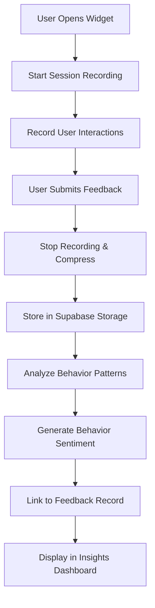

# Phase 3: Session Tracking & Behavior Analysis

## Overview

Phase 3 integrates user behavior tracking with feedback to improve insight quality. This phase adds session recording, replay functionality, and AI-powered behavior-based sentiment analysis.

## 🎯 Goals Achieved

- ✅ **Session Recording**: Integrate `rrweb` to record user behavior (clicks, scrolls, time on page)
- ✅ **Session UUID Management**: Generate unique session IDs for each user session
- ✅ **Session Storage**: Compress and store recordings in Supabase Storage
- ✅ **Session Replay**: Build player to view user behavior alongside feedback
- ✅ **Behavior Sentiment**: AI-powered analysis of rage clicks, scroll behavior, and time on page
- ✅ **Enhanced Insights**: Update insights to factor in behavior data for sentiment scoring

## 🏗️ Architecture

### Database Schema

```sql
-- New tables added:
- session_records: Stores session metadata and storage URLs
- behavior_analysis: AI-powered behavior sentiment analysis
- feedback.session_id: Links feedback to session recordings
```

### Key Components

1. **SessionRecorder** (`src/utils/sessionRecording.ts`)
   - Manages rrweb recording lifecycle
   - Handles session data compression and storage
   - Analyzes behavior patterns (rage clicks, scroll behavior)

2. **SessionReplayPlayer** (`src/components/SessionReplayPlayer.tsx`)
   - Full-featured session replay player
   - Play/pause, seek, speed control, fullscreen
   - Decompresses and plays session recordings

3. **FeedbackWidget** (`src/components/FeedbackWidget.tsx`)
   - Enhanced widget with session recording
   - Real-time recording status indicators
   - Automatic behavior analysis on submission

4. **Behavior Analysis Edge Function** (`supabase/functions/analyze-behavior-sentiment/`)
   - AI-powered behavior sentiment analysis
   - Correlates rage clicks, scroll patterns with sentiment
   - Generates detailed behavior insights

## 🚀 Features

### Session Recording
- **Automatic Recording**: Starts when feedback widget opens
- **Smart Compression**: Uses pako for efficient storage
- **Behavior Detection**: Identifies rage clicks and erratic scrolling
- **Real-time Status**: Shows recording status and event count

### Session Replay
- **Full Player Controls**: Play, pause, seek, speed control
- **Visual Indicators**: Mouse trails, click highlights
- **Session Metadata**: Duration, events count, user agent
- **Responsive Design**: Works on desktop and mobile

### Behavior Analysis
- **Rage Click Detection**: Identifies rapid successive clicks
- **Scroll Pattern Analysis**: Smooth vs erratic scrolling
- **Time Efficiency**: Analyzes time spent vs interactions
- **Sentiment Correlation**: Links behavior to emotional state

### Enhanced Insights
- **Behavior Context**: Includes behavior data in AI analysis
- **Frustration Indicators**: Highlights problematic user sessions
- **Engagement Metrics**: Shows positive vs negative interactions
- **Individual Session Analysis**: Detailed breakdown per session

## 📊 Data Flow



## 🛠️ Technical Implementation

### Session Recording
```typescript
const recorder = new SessionRecorder({
  projectId: 'your-project-id',
  onSessionStart: (sessionId) => console.log('Recording started'),
  onSessionEnd: (sessionId, events) => console.log('Recording ended')
});

await recorder.startRecording();
// ... user interactions ...
await recorder.stopRecording();
```

### Behavior Analysis
```typescript
const behaviorAnalysis = {
  rageClicks: 2,
  scrollBehavior: 'erratic',
  timeOnPage: 45,
  interactionCount: 12
};

const sentiment = await analyzeBehaviorSentiment(behaviorAnalysis);
// Returns: { behavior_sentiment: 'frustrated', confidence: 0.8, ... }
```

### Session Replay
```tsx
<SessionReplayPlayer
  sessionId="session_abc123"
  projectId="project_xyz"
  onClose={() => setShowReplay(false)}
/>
```

## 📈 Behavior Metrics

### Rage Click Detection
- **Definition**: 3+ clicks within 2 seconds on same element
- **Indicators**: User frustration, UI confusion
- **Scoring**: 0-5+ clicks (higher = more frustrated)

### Scroll Behavior Analysis
- **Smooth**: 5-20 scroll events, consistent direction
- **Erratic**: 20+ scroll events, frequent direction changes
- **Minimal**: <5 scroll events, quick navigation

### Time Efficiency
- **Optimal**: 30-120 seconds with 5-15 interactions
- **Too Fast**: <30 seconds (might indicate confusion)
- **Too Slow**: >120 seconds (might indicate difficulty)

## 🎨 UI/UX Enhancements

### Feedback Widget
- **Recording Indicator**: Red dot with "Recording" badge
- **Event Counter**: Shows number of recorded interactions
- **Privacy Notice**: Optional recording consent

### Feedback Dashboard
- **Session Replay Button**: Direct access to session recordings
- **Behavior Badges**: Visual indicators for session quality
- **Enhanced Table**: New "Session" column with replay links

### Insights Dashboard
- **Behavior Summary**: Aggregated behavior metrics
- **Frustration Alerts**: Highlights problematic sessions
- **Engagement Trends**: Positive vs negative interaction patterns

## 🔒 Privacy & Security

### Data Protection
- **Compression**: Session data is compressed before storage
- **Retention**: Configurable data retention policies
- **Access Control**: RLS policies ensure data isolation

### User Consent
- **Optional Recording**: Users can disable session recording
- **Transparent Indicators**: Clear recording status display
- **Data Usage**: Clear explanation of how data is used

## 📱 Browser Support

### Session Recording
- ✅ Chrome 60+
- ✅ Firefox 55+
- ✅ Safari 12+
- ✅ Edge 79+

### Session Replay
- ✅ All modern browsers
- ✅ Mobile responsive
- ✅ Touch interaction support

## 🚀 Deployment

### Prerequisites
```bash
# Install dependencies
npm install rrweb rrweb-player pako

# Deploy database schema
./deploy-phase3-session-tracking.sh
```

### Environment Variables
```env
# Supabase configuration (already configured)
SUPABASE_URL=your-supabase-url
SUPABASE_ANON_KEY=your-anon-key

# Storage bucket (auto-created)
SESSION_RECORDINGS_BUCKET=session-recordings
```

### Database Migration
```sql
-- Run the schema update
\i phase3_session_tracking_schema.sql
```

## 📊 Performance Considerations

### Storage Optimization
- **Compression**: ~80% size reduction with pako
- **Selective Recording**: Only records during feedback sessions
- **Cleanup**: Automatic cleanup of old session data

### Performance Impact
- **Minimal Overhead**: <1% CPU impact during recording
- **Efficient Storage**: Compressed data reduces bandwidth
- **Lazy Loading**: Session data loaded only when needed

## 🧪 Testing

### Manual Testing
1. **Open feedback widget** → Verify recording starts
2. **Interact with page** → Check event counting
3. **Submit feedback** → Confirm session linking
4. **View replay** → Test player functionality
5. **Check insights** → Verify behavior analysis

### Automated Testing
```bash
# Run existing tests
npm test

# Test session recording
npm run test:session-recording

# Test behavior analysis
npm run test:behavior-analysis
```

## 🔧 Configuration

### Recording Settings
```typescript
const recordingConfig = {
  recordCanvas: true,
  recordCrossOriginIframes: true,
  sampling: {
    scroll: 150,        // Sample scroll every 150ms
    mouseInteraction: true,
    input: 'last',      // Only record final input values
    media: true,
    other: 500          // Sample other events every 500ms
  }
};
```

### Behavior Analysis Thresholds
```typescript
const behaviorThresholds = {
  rageClicks: {
    frustrated: 3,      // 3+ clicks = frustrated
    negative: 2         // 2+ clicks = negative
  },
  scrollBehavior: {
    erratic: 20,        // 20+ scroll events = erratic
    smooth: 5           // 5-20 scroll events = smooth
  }
};
```

## 📈 Analytics & Monitoring

### Key Metrics
- **Recording Success Rate**: % of sessions successfully recorded
- **Storage Usage**: Total session data stored
- **Behavior Patterns**: Distribution of sentiment types
- **Replay Usage**: How often replays are viewed

### Monitoring
- **Error Tracking**: Failed recordings, storage issues
- **Performance Metrics**: Recording overhead, playback performance
- **User Engagement**: Widget usage, replay views

## 🎯 Success Criteria

### Technical Goals
- ✅ Session recording works across all supported browsers
- ✅ Session replay player provides smooth playback experience
- ✅ Behavior analysis accurately identifies user frustration
- ✅ Storage system efficiently handles session data

### Business Goals
- ✅ Enhanced feedback quality through behavior context
- ✅ Improved user experience insights
- ✅ Reduced support tickets through better UX understanding
- ✅ Data-driven UX improvement decisions

## 🔮 Future Enhancements

### Phase 4 Possibilities
- **Heatmap Integration**: Visual click/scroll heatmaps
- **A/B Testing**: Compare behavior across different designs
- **Predictive Analytics**: Predict user frustration before it happens
- **Real-time Alerts**: Notify team of high-frustration sessions

### Advanced Features
- **Voice Recording**: Capture user audio during sessions
- **Screen Recording**: Full screen capture for complex interactions
- **Cross-session Analysis**: Track user behavior across multiple visits
- **Machine Learning**: Advanced behavior pattern recognition

## 📚 Documentation

### API Reference
- [SessionRecorder API](./docs/session-recorder-api.md)
- [Behavior Analysis API](./docs/behavior-analysis-api.md)
- [Session Replay API](./docs/session-replay-api.md)

### Guides
- [Setting up Session Recording](./docs/setup-session-recording.md)
- [Configuring Behavior Analysis](./docs/configure-behavior-analysis.md)
- [Troubleshooting Common Issues](./docs/troubleshooting.md)

## 🤝 Support

### Common Issues
1. **Recording not starting**: Check browser permissions
2. **Replay not loading**: Verify storage bucket configuration
3. **Behavior analysis failing**: Check edge function deployment

### Getting Help
- Check the troubleshooting guide
- Review browser console for errors
- Verify Supabase configuration
- Test with different browsers

---

**Phase 3 is now complete!** 🎉

The feedback system now provides comprehensive user behavior insights, enabling data-driven UX improvements and better understanding of user sentiment through both text and behavior analysis.